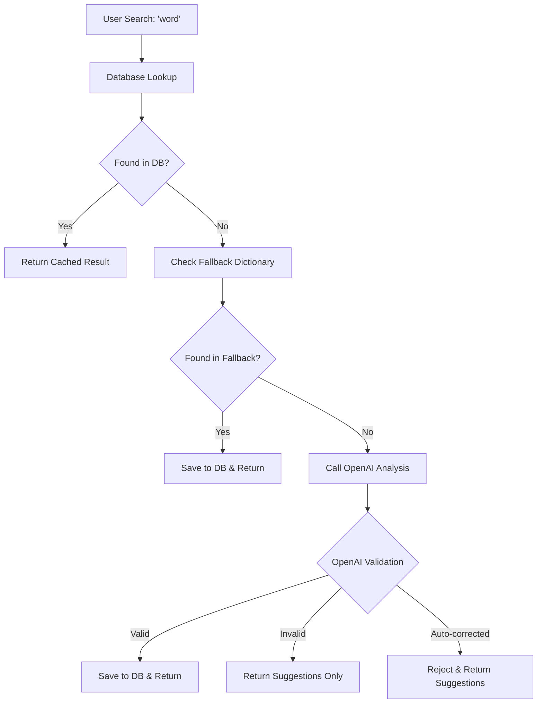

# German Learning Platform - Search Logic Bug Fix

## Overview

This document details the critical search logic bug that was identified and fixed in the German learning platform, along with the comprehensive solution implemented to prevent incorrect word mappings from being saved to the database.

## The Problem

### Bug Description
When users searched for non-existent or misspelled German words, the system would sometimes save incorrect word mappings to the database. For example:

- User searches: `"nim"` (not a valid German word)
- OpenAI auto-corrects to: `"nehmen"` (valid German verb)
- System saves: `nim → nehmen` mapping to database
- Future searches for `"nim"` return `"nehmen"` from cache

This created a **data corruption issue** where invalid words became permanently associated with valid German words.

### Root Cause
The OpenAI prompt was designed to be "helpful" and would auto-correct misspelled words instead of properly rejecting invalid input, combined with insufficient validation before saving to the database.

## Current Search Logic Flow

### 1. Search Entry Point
```
/api/translate/word → EnhancedVocabularyService.get_or_create_word_enhanced()
                  ↓
                  VocabularyService.get_or_create_word()
```

### 2. Database Search Process


### 3. Detailed Search Steps

#### Step 1: Database Lookup (`_find_existing_word`)
1. **Exact Match**: Direct lemma comparison (case-insensitive)
2. **Word Form Match**: Check inflected forms (e.g., `gehe` → `gehen`)
3. **Article Removal**: Strip German articles (`der/die/das Tisch` → `Tisch`)
4. **Fuzzy Matching**: Edit distance similarity for words ≥4 characters (85% threshold)

#### Step 2: Fallback Dictionary
- Built-in dictionary with ~20 common German words
- Used when OpenAI is unavailable or for basic words

#### Step 3: OpenAI Analysis with Validation
- Enhanced prompt with strict validation requirements
- Input validation to prevent auto-correction
- Similarity checking to ensure analyzed word matches input

## OpenAI Prompt Engineering

### Original Problematic Prompt
```
Analyze the word "{word}" and return a JSON response.

If "{word}" is a valid German word...
```

**Issues:**
- No explicit instruction against auto-correction
- Encouraged "helpful" behavior that substituted similar words
- No validation of input word vs analyzed word

### Fixed Enhanced Prompt
```
IMPORTANT: Analyze the EXACT word "{word}" as provided. Do not auto-correct or substitute it with similar words.

First, determine if "{word}" is a valid German word (exact match only):
- Check if it's a valid German lemma, inflected form, or compound word
- Do NOT consider it valid if it's just similar to a German word
- Do NOT auto-correct spelling mistakes

If "{word}" is EXACTLY a valid German word, return:
{
    "found": true,
    "input_word": "{word}",
    "pos": "verb|noun|adjective|adverb|preposition|article|pronoun|other",
    "lemma": "base form" (if different from input),
    "article": "der|die|das" (only for nouns, null otherwise),
    "plural": "plural form" (only for nouns, null otherwise),
    "tables": {
        "praesens": {"ich": "form", "du": "form", "er_sie_es": "form", "wir": "form", "ihr": "form", "sie_Sie": "form"},
        "praeteritum": {"ich": "form", "du": "form", "er_sie_es": "form", "wir": "form", "ihr": "form", "sie_Sie": "form"},
        "perfekt": {"aux": "haben|sein", "partizip_ii": "form", "ich": "habe/bin + partizip", "er_sie_es": "hat/ist + partizip"},
        "futur1": {"ich": "werde form", "du": "wirst form", "er_sie_es": "wird form", "wir": "werden form", "ihr": "werdet form", "sie_Sie": "werden form"}
    } (only for verbs, null otherwise),
    "translations_en": ["translation1", "translation2"],
    "translations_zh": ["翻译1", "翻译2"],
    "example": {"de": "German sentence", "en": "English sentence", "zh": "中文句子"}
}

If "{word}" is NOT a valid German word (including typos, non-German words, gibberish), return:
{
    "found": false,
    "input_word": "{word}",
    "suggestions": [
        {"word": "similar_word1", "pos": "noun", "meaning": "brief explanation"},
        {"word": "similar_word2", "pos": "verb", "meaning": "brief explanation"},
        {"word": "similar_word3", "pos": "adjective", "meaning": "brief explanation"},
        {"word": "similar_word4", "pos": "noun", "meaning": "brief explanation"},
        {"word": "similar_word5", "pos": "verb", "meaning": "brief explanation"}
    ],
    "message": "'{word}' is not a recognized German word. Here are some similar words you might be looking for:"
}

Examples:
- "nim" → found: false (not a valid German word, suggest "nehmen")
- "gehe" → found: true (valid inflected form of "gehen")
- "xyz123" → found: false (gibberish)
```

### Key Prompt Improvements
1. **Explicit anti-correction instructions**
2. **`input_word` field** for validation tracking
3. **Clear examples** of expected behavior
4. **Structured suggestion format** for invalid words
5. **Emphasis on exact matching only**

## Validation Safeguards

### Input Validation Layer
```python
# CRITICAL VALIDATION: Ensure OpenAI analyzed the correct word
input_word_from_openai = openai_analysis.get("input_word", "").strip().lower()
original_query_lower = lemma.strip().lower()

if input_word_from_openai and input_word_from_openai != original_query_lower:
    print(f"⚠️ VALIDATION FAILED: OpenAI analyzed '{input_word_from_openai}' but user searched '{original_query_lower}'")
    # OpenAI auto-corrected the word - treat as "not found" and return suggestions
    await self._log_search_history(db, user, lemma, "word_lookup_autocorrected", from_database=False)
    return {
        "found": False,
        "original": lemma,
        "suggestions": openai_analysis.get("suggestions", [
            {"word": openai_analysis.get("lemma", ""), "pos": openai_analysis.get("pos", ""), "meaning": "Possible correction"}
        ]) if openai_analysis.get("lemma") else [],
        "message": f"'{lemma}' is not a recognized German word. Did you mean '{openai_analysis.get('lemma', '')}'?",
        "source": "validation_rejected"
    }
```

### Database Integrity Protection
```python
# Verify lemma consistency before saving
analyzed_lemma = openai_analysis.get("lemma", original_query).strip()
pos = openai_analysis.get("pos", "unknown")

# Re-validate lemma matching
if analyzed_lemma.lower() != original_query.strip().lower():
    print(f"⚠️ Lemma mismatch in save: analyzed='{analyzed_lemma}', query='{original_query}' - using query")
    analyzed_lemma = original_query.strip()

# Create word entry with validated data
word = WordLemma(
    lemma=analyzed_lemma,  # Use validated lemma
    pos=pos,
    cefr="A1",
    notes=f"Auto-generated from OpenAI on query: {original_query}"
)
```

## Fuzzy Matching Implementation

### Edit Distance Algorithm
```python
def _calculate_similarity(self, word1: str, word2: str) -> float:
    """Calculate similarity between two words using edit distance"""
    word1, word2 = word1.lower(), word2.lower()
    
    if word1 == word2:
        return 1.0
    
    # Levenshtein distance implementation
    len1, len2 = len(word1), len(word2)
    dp = [[0] * (len2 + 1) for _ in range(len1 + 1)]
    
    # Initialize base cases
    for i in range(len1 + 1):
        dp[i][0] = i
    for j in range(len2 + 1):
        dp[0][j] = j
    
    # Fill dynamic programming matrix
    for i in range(1, len1 + 1):
        for j in range(1, len2 + 1):
            if word1[i-1] == word2[j-1]:
                dp[i][j] = dp[i-1][j-1]
            else:
                dp[i][j] = min(
                    dp[i-1][j] + 1,     # deletion
                    dp[i][j-1] + 1,     # insertion
                    dp[i-1][j-1] + 1    # substitution
                )
    
    edit_distance = dp[len1][len2]
    max_len = max(len1, len2)
    
    return 1.0 - (edit_distance / max_len) if max_len > 0 else 0.0
```

### Fuzzy Match Configuration
- **Minimum word length**: 4 characters (prevents short word false positives)
- **Similarity threshold**: 85% (prevents loose matches)
- **Length constraint**: ±2 characters maximum difference
- **Candidate limit**: 50 words per search (performance optimization)

## Search Result Types

### 1. Database Hit (Cached)
```json
{
    "found": true,
    "original": "gehen",
    "pos": "verb",
    "article": null,
    "tables": { /* verb conjugation tables */ },
    "translations_en": ["to go", "to walk"],
    "translations_zh": ["去", "走"],
    "example": {"de": "Wir gehen nach Hause.", "en": "We go home.", "zh": "我们回家。"},
    "cached": true,
    "source": "database"
}
```

### 2. Valid Word (OpenAI Analysis)
```json
{
    "found": true,
    "original": "sprechen",
    "pos": "verb",
    "lemma": "sprechen",
    "tables": { /* conjugation data */ },
    "translations_en": ["to speak", "to talk"],
    "translations_zh": ["说话", "讲"],
    "example": {"de": "Sprechen Sie Deutsch?", "en": "Do you speak German?", "zh": "您说德语吗？"},
    "cached": false,
    "source": "openai"
}
```

### 3. Invalid Word (Suggestions)
```json
{
    "found": false,
    "original": "nim",
    "suggestions": [
        {"word": "nehmen", "pos": "verb", "meaning": "to take"},
        {"word": "nimm", "pos": "verb", "meaning": "take (imperative)"},
        {"word": "Name", "pos": "noun", "meaning": "name"}
    ],
    "message": "'nim' is not a recognized German word. Here are some similar words you might be looking for:",
    "source": "openai_suggestions"
}
```

### 4. Validation Rejected (Auto-correction Detected)
```json
{
    "found": false,
    "original": "nim",
    "suggestions": [
        {"word": "nehmen", "pos": "verb", "meaning": "Possible correction"}
    ],
    "message": "'nim' is not a recognized German word. Did you mean 'nehmen'?",
    "source": "validation_rejected"
}
```

## Testing Scenarios

### Test Cases

| Input | Expected Behavior | Result Type |
|-------|------------------|-------------|
| `"gehen"` | Return valid verb analysis | Database hit or OpenAI valid |
| `"gehe"` | Find inflected form → `"gehen"` | Database hit (form lookup) |
| `"der Tisch"` | Strip article → find `"Tisch"` | Database hit (article removal) |
| `"gehn"` | Fuzzy match → `"gehen"` | Database hit (similarity) |
| `"nim"` | Reject with suggestions | Invalid word suggestions |
| `"xyz123"` | Reject as gibberish | Invalid word (no suggestions) |
| `"Kartoffel"` vs `"Kartoffeln"` | Keep both (plural forms) | Both valid, different entries |

### Performance Considerations

1. **Database Query Optimization**:
   - ILIKE queries with indexes on lemma fields
   - Limited candidate sets for fuzzy matching
   - Cached translation and example queries

2. **OpenAI Rate Limiting**:
   - Fallback dictionary for common words
   - Proper error handling for API failures
   - Request timeout and retry logic

3. **Memory Usage**:
   - Streaming database queries for large datasets
   - Efficient edit distance algorithm (O(mn) complexity)
   - Limited similarity candidate processing

## Migration and Cleanup

### Duplicate Detection Script
The system includes a comprehensive deduplication script (`scripts/fixes/deduplicate_words.py`) that:

1. **Finds exact duplicates** (case-insensitive lemma matching)
2. **Identifies similar words** with configurable similarity thresholds
3. **Excludes grammatical variations** (plurals, declensions, gender forms)
4. **Merges duplicate entries** while preserving all translations and examples
5. **Provides dry-run mode** for safe analysis

### Current Database Status
- ✅ **No exact duplicates** found
- 🔍 **81 similar word pairs** identified (mostly legitimate variations)
- 📊 **2,769 total words** with complete translation data

## Configuration

### Environment Variables
```bash
OPENAI_API_KEY=your_api_key_here
OPENAI_BASE_URL=https://api.openai.com/v1  # or alternative endpoint
OPENAI_MODEL=gpt-4  # or preferred model
```

### Search Parameters
```python
# Fuzzy matching
SIMILARITY_THRESHOLD = 0.85
MIN_WORD_LENGTH_FOR_FUZZY = 4
MAX_FUZZY_CANDIDATES = 50

# Database lookup
CASE_INSENSITIVE_SEARCH = True
ARTICLE_STRIPPING_ENABLED = True
WORD_FORM_LOOKUP_ENABLED = True
```

## Monitoring and Logging

### Search History Tracking
All searches are logged with detailed metadata:
```python
await self._log_search_history(db, user, lemma, query_type, from_database)
```

Query types include:
- `word_lookup_db` - Found in database
- `word_lookup_api` - Retrieved from OpenAI
- `word_lookup_not_found` - Invalid word
- `word_lookup_autocorrected` - Validation rejected

### Debug Output
The system provides detailed console logging:
```
🔍 Found similar word: 'gehn' -> 'gehen' (similarity: 0.89)
✅ Validation passed: gehen (verb) - EN: 2, ZH: 2
⚠️ VALIDATION FAILED: OpenAI analyzed 'nehmen' but user searched 'nim'
```

## Future Improvements

### Planned Enhancements
1. **Machine Learning Integration**: Train custom similarity models on German linguistic patterns
2. **Advanced Grammar Detection**: Better handling of compound words and separable verbs
3. **User Feedback Loop**: Allow users to report incorrect suggestions
4. **Performance Optimization**: Implement Redis caching for frequently searched words
5. **Multi-language Support**: Extend validation logic to other languages

### Monitoring Metrics
- Search success rate (found vs not found)
- OpenAI API usage and costs
- User satisfaction with suggestions
- Database growth rate and quality

---

## Conclusion

The search logic bug fix addresses a critical data integrity issue while implementing comprehensive safeguards against future corruption. The enhanced system now properly distinguishes between valid German words, invalid input, and potential typos, ensuring that only accurate linguistic data is stored in the database.

The multi-layered approach (database optimization, fuzzy matching, OpenAI validation, and input verification) provides a robust foundation for accurate German language learning while maintaining performance and user experience.