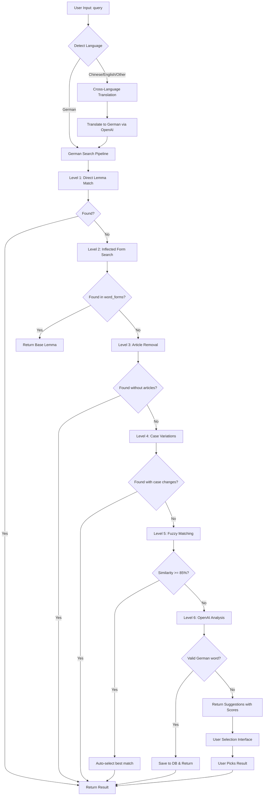

# German Learning Platform - Complete Search Logic Documentation

## Overview

This document provides a comprehensive guide to the German language search system, including the critical bug fix, database schema, SQL queries, and enhanced features that address user feedback.

## Table of Contents

1. [Database Schema](#database-schema)
2. [Search Logic Flow](#search-logic-flow)
3. [SQL Query Implementation](#sql-query-implementation)
4. [OpenAI Prompt Engineering](#openai-prompt-engineering)
5. [Cross-Language Support](#cross-language-support)
6. [Multiple Results & User Selection](#multiple-results--user-selection)
7. [Similarity Scoring & Transparency](#similarity-scoring--transparency)
8. [Performance Optimization](#performance-optimization)
9. [API Examples](#api-examples)

---

## Database Schema

### Core Tables

```sql
-- Main word entries (lemmas/base forms)
CREATE TABLE word_lemmas (
    id INTEGER PRIMARY KEY AUTOINCREMENT,
    lemma VARCHAR(100) NOT NULL,           -- Base form: "gehen", "Kartoffel"
    pos VARCHAR(20),                       -- Part of speech: verb, noun, etc.
    cefr VARCHAR(5),                       -- Language level: A1, A2, B1, etc.
    ipa VARCHAR(200),                      -- Pronunciation guide
    frequency INTEGER,                     -- Usage frequency
    notes TEXT,                            -- Additional information
    created_at TIMESTAMP DEFAULT CURRENT_TIMESTAMP
);

-- Word forms and inflections
CREATE TABLE word_forms (
    id INTEGER PRIMARY KEY AUTOINCREMENT,
    lemma_id INTEGER REFERENCES word_lemmas(id),
    form VARCHAR(100) NOT NULL,            -- Inflected form: "gehe", "gehst", "Kartoffeln"
    feature_key VARCHAR(50),               -- Type: tense, number, case, etc.
    feature_value VARCHAR(100),            -- Value: present_1st_sg, plural, etc.
    created_at TIMESTAMP DEFAULT CURRENT_TIMESTAMP
);

-- Translations
CREATE TABLE translations (
    id INTEGER PRIMARY KEY AUTOINCREMENT,
    lemma_id INTEGER REFERENCES word_lemmas(id),
    lang_code VARCHAR(5) NOT NULL,         -- en, zh, fr, etc.
    text VARCHAR(200) NOT NULL,            -- Translation text
    source VARCHAR(50),                    -- openai, manual, fallback
    created_at TIMESTAMP DEFAULT CURRENT_TIMESTAMP
);

-- Examples and sentences
CREATE TABLE examples (
    id INTEGER PRIMARY KEY AUTOINCREMENT,
    lemma_id INTEGER REFERENCES word_lemmas(id),
    de_text TEXT NOT NULL,                 -- German example
    en_text TEXT,                          -- English translation
    zh_text TEXT,                          -- Chinese translation
    level VARCHAR(5),                      -- Difficulty level
    created_at TIMESTAMP DEFAULT CURRENT_TIMESTAMP
);

-- Search history and analytics
CREATE TABLE search_history (
    id INTEGER PRIMARY KEY AUTOINCREMENT,
    user_id INTEGER REFERENCES users(id),
    query_text VARCHAR(200) NOT NULL,      -- What user searched
    query_type VARCHAR(50),                -- word_lookup, sentence_translation
    found BOOLEAN,                         -- Whether result was found
    source VARCHAR(50),                    -- database, openai, fallback
    similarity_score REAL,                 -- For fuzzy matches
    created_at TIMESTAMP DEFAULT CURRENT_TIMESTAMP
);

-- Indexes for performance
CREATE INDEX idx_word_lemmas_lemma ON word_lemmas(lemma);
CREATE INDEX idx_word_lemmas_pos ON word_lemmas(pos);
CREATE INDEX idx_word_forms_form ON word_forms(form);
CREATE INDEX idx_word_forms_lemma_id ON word_forms(lemma_id);
CREATE INDEX idx_translations_lemma_id ON translations(lemma_id);
CREATE INDEX idx_translations_lang_code ON translations(lang_code);
CREATE INDEX idx_examples_lemma_id ON examples(lemma_id);
CREATE INDEX idx_search_history_user_id ON search_history(user_id);
CREATE INDEX idx_search_history_query_text ON search_history(query_text);
```

### Example Data Structure

```sql
-- Base word entry
INSERT INTO word_lemmas (lemma, pos, cefr) VALUES ('gehen', 'verb', 'A1');

-- Inflected forms pointing to base
INSERT INTO word_forms (lemma_id, form, feature_key, feature_value) VALUES 
(1, 'gehe', 'tense_person', 'present_1st_sg'),
(1, 'gehst', 'tense_person', 'present_2nd_sg'),
(1, 'geht', 'tense_person', 'present_3rd_sg'),
(1, 'gehen', 'tense_person', 'present_1st_pl'),
(1, 'geht', 'tense_person', 'present_2nd_pl'),
(1, 'gehen', 'tense_person', 'present_3rd_pl');

-- Translations
INSERT INTO translations (lemma_id, lang_code, text, source) VALUES 
(1, 'en', 'to go', 'manual'),
(1, 'en', 'to walk', 'manual'),
(1, 'zh', '去', 'manual'),
(1, 'zh', '走', 'manual');

-- Examples
INSERT INTO examples (lemma_id, de_text, en_text, zh_text, level) VALUES 
(1, 'Wir gehen nach Hause.', 'We go home.', '我们回家。', 'A1');
```

---

## Search Logic Flow

### Complete Search Algorithm



---

## SQL Query Implementation

### Level 1: Direct Lemma Match

```sql
-- Basic exact match (case-insensitive)
SELECT 
    wl.id,
    wl.lemma,
    wl.pos,
    wl.cefr,
    wl.notes
FROM word_lemmas wl 
WHERE LOWER(wl.lemma) = LOWER(?)
LIMIT 1;

-- With translations and examples
SELECT 
    wl.id,
    wl.lemma,
    wl.pos,
    wl.cefr,
    GROUP_CONCAT(CASE WHEN t.lang_code = 'en' THEN t.text END) as translations_en,
    GROUP_CONCAT(CASE WHEN t.lang_code = 'zh' THEN t.text END) as translations_zh,
    e.de_text as example_de,
    e.en_text as example_en,
    e.zh_text as example_zh
FROM word_lemmas wl
LEFT JOIN translations t ON t.lemma_id = wl.id
LEFT JOIN examples e ON e.lemma_id = wl.id
WHERE LOWER(wl.lemma) = LOWER(?)
GROUP BY wl.id
LIMIT 1;
```

### Level 2: Inflected Form Search

```sql
-- Find base form from inflected form (gehe → gehen)
SELECT 
    wl.id,
    wl.lemma,
    wl.pos,
    wf.form as searched_form,
    wf.feature_key,
    wf.feature_value,
    'inflected_form' as match_type
FROM word_lemmas wl
JOIN word_forms wf ON wf.lemma_id = wl.id
WHERE LOWER(wf.form) = LOWER(?)
ORDER BY wl.frequency DESC NULLS LAST
LIMIT 1;

-- Advanced inflected form search with grammatical details
SELECT 
    wl.id,
    wl.lemma,
    wl.pos,
    wl.cefr,
    wf.form as searched_form,
    wf.feature_key,
    wf.feature_value,
    CASE 
        WHEN wf.feature_key = 'tense_person' THEN 'verb_conjugation'
        WHEN wf.feature_key = 'number' THEN 'noun_plural'
        WHEN wf.feature_key = 'case' THEN 'noun_declension'
        ELSE 'other_inflection'
    END as inflection_type,
    GROUP_CONCAT(CASE WHEN t.lang_code = 'en' THEN t.text END) as translations_en,
    GROUP_CONCAT(CASE WHEN t.lang_code = 'zh' THEN t.text END) as translations_zh
FROM word_lemmas wl
JOIN word_forms wf ON wf.lemma_id = wl.id
LEFT JOIN translations t ON t.lemma_id = wl.id
WHERE LOWER(wf.form) = LOWER(?)
GROUP BY wl.id, wf.id
ORDER BY wl.frequency DESC NULLS LAST
LIMIT 1;
```

### Level 3: Article Removal

```sql
-- Remove German articles and search (der Tisch → Tisch)
WITH article_removed AS (
    SELECT 
        CASE 
            WHEN LOWER(?) LIKE 'der %' THEN TRIM(SUBSTR(?, 4))
            WHEN LOWER(?) LIKE 'die %' THEN TRIM(SUBSTR(?, 4))
            WHEN LOWER(?) LIKE 'das %' THEN TRIM(SUBSTR(?, 4))
            WHEN LOWER(?) LIKE 'ein %' THEN TRIM(SUBSTR(?, 4))
            WHEN LOWER(?) LIKE 'eine %' THEN TRIM(SUBSTR(?, 5))
            WHEN LOWER(?) LIKE 'einen %' THEN TRIM(SUBSTR(?, 6))
            WHEN LOWER(?) LIKE 'einem %' THEN TRIM(SUBSTR(?, 6))
            WHEN LOWER(?) LIKE 'einer %' THEN TRIM(SUBSTR(?, 6))
            ELSE ?
        END as clean_query
)
SELECT 
    wl.id,
    wl.lemma,
    wl.pos,
    'article_removed' as match_type,
    ar.clean_query as cleaned_input
FROM word_lemmas wl, article_removed ar
WHERE LOWER(wl.lemma) = LOWER(ar.clean_query)
AND ar.clean_query != ?  -- Only if article was actually removed
LIMIT 1;
```

### Level 4: Case Variations

```sql
-- Search with different case variations
SELECT 
    wl.id,
    wl.lemma,
    wl.pos,
    'case_variation' as match_type,
    CASE 
        WHEN wl.lemma = LOWER(?) THEN 'lowercase'
        WHEN wl.lemma = UPPER(?) THEN 'uppercase'  
        WHEN wl.lemma = ? THEN 'title_case'
        ELSE 'other_case'
    END as case_type
FROM word_lemmas wl
WHERE wl.lemma IN (
    LOWER(?),
    UPPER(?),
    TRIM(UPPER(SUBSTR(?, 1, 1)) || LOWER(SUBSTR(?, 2))), -- Title case
    ?
)
AND wl.lemma != ?  -- Exclude exact matches (already tried)
ORDER BY 
    CASE case_type
        WHEN 'title_case' THEN 1
        WHEN 'lowercase' THEN 2
        WHEN 'uppercase' THEN 3
        ELSE 4
    END
LIMIT 1;
```

### Level 5: Fuzzy Matching with Similarity Scoring

```sql
-- Get candidates for fuzzy matching (performance optimized)
SELECT 
    wl.id,
    wl.lemma,
    wl.pos,
    wl.frequency,
    LENGTH(wl.lemma) as lemma_length
FROM word_lemmas wl
WHERE LENGTH(wl.lemma) BETWEEN (LENGTH(?) - 2) AND (LENGTH(?) + 2)
AND wl.lemma IS NOT NULL
AND LENGTH(wl.lemma) >= 3
ORDER BY 
    ABS(LENGTH(wl.lemma) - LENGTH(?)),  -- Prefer similar length
    wl.frequency DESC NULLS LAST       -- Prefer common words
LIMIT 50;

-- For each candidate, calculate similarity in application code
-- Then return matches above threshold:

-- Get detailed info for fuzzy matches
SELECT 
    wl.id,
    wl.lemma,
    wl.pos,
    wl.cefr,
    GROUP_CONCAT(CASE WHEN t.lang_code = 'en' THEN t.text END, ', ') as translations_en,
    GROUP_CONCAT(CASE WHEN t.lang_code = 'zh' THEN t.text END, ', ') as translations_zh,
    ? as similarity_score,  -- Calculated in application
    'fuzzy_match' as match_type
FROM word_lemmas wl
LEFT JOIN translations t ON t.lemma_id = wl.id
WHERE wl.id IN (?, ?, ?, ?)  -- IDs of similar words
GROUP BY wl.id
ORDER BY ? DESC;  -- Order by similarity score
```

### Level 6: Multiple Results & Suggestions

```sql
-- Get multiple similar results for user selection
WITH similarity_results AS (
    SELECT 
        wl.id,
        wl.lemma,
        wl.pos,
        wl.cefr,
        ? as similarity_score,
        CASE 
            WHEN ? >= 0.9 THEN 'very_high'
            WHEN ? >= 0.8 THEN 'high'
            WHEN ? >= 0.6 THEN 'medium'
            WHEN ? >= 0.4 THEN 'low'
            ELSE 'very_low'
        END as confidence_level
    FROM word_lemmas wl
    WHERE wl.id = ?  -- Repeat for each similar word found
)
SELECT 
    sr.id,
    sr.lemma,
    sr.pos,
    sr.cefr,
    sr.similarity_score,
    sr.confidence_level,
    GROUP_CONCAT(CASE WHEN t.lang_code = 'en' THEN t.text END, ', ') as translations_en,
    GROUP_CONCAT(CASE WHEN t.lang_code = 'zh' THEN t.text END, ', ') as translations_zh,
    e.de_text as example_de,
    e.en_text as example_en,
    e.zh_text as example_zh
FROM similarity_results sr
LEFT JOIN translations t ON t.lemma_id = sr.id
LEFT JOIN examples e ON e.lemma_id = sr.id
GROUP BY sr.id
ORDER BY sr.similarity_score DESC, sr.cefr ASC
LIMIT 5;
```

### Search Analytics and Logging

```sql
-- Log search attempt
INSERT INTO search_history (
    user_id, 
    query_text, 
    query_type, 
    found, 
    source, 
    similarity_score,
    created_at
) VALUES (?, ?, ?, ?, ?, ?, CURRENT_TIMESTAMP);

-- Get search statistics
SELECT 
    DATE(created_at) as search_date,
    COUNT(*) as total_searches,
    COUNT(CASE WHEN found = 1 THEN 1 END) as successful_searches,
    COUNT(CASE WHEN source = 'database' THEN 1 END) as db_hits,
    COUNT(CASE WHEN source = 'openai' THEN 1 END) as openai_calls,
    AVG(CASE WHEN similarity_score IS NOT NULL THEN similarity_score END) as avg_similarity
FROM search_history 
WHERE created_at >= DATE('now', '-30 days')
GROUP BY DATE(created_at)
ORDER BY search_date DESC;

-- Most searched words not found
SELECT 
    query_text,
    COUNT(*) as search_count,
    MAX(created_at) as last_searched
FROM search_history 
WHERE found = 0 
AND created_at >= DATE('now', '-7 days')
GROUP BY query_text
HAVING COUNT(*) >= 3
ORDER BY search_count DESC
LIMIT 10;
```

---

## OpenAI Prompt Engineering

### Enhanced German Analysis Prompt

```python
def create_german_analysis_prompt(word: str) -> str:
    return f"""
TASK: Analyze the German word "{word}" with strict validation.

CRITICAL RULES:
1. Analyze ONLY the exact input "{word}" - do NOT auto-correct
2. If "{word}" is valid German (including inflections, plurals), return found: true
3. If "{word}" is invalid German, return found: false with suggestions
4. Include similarity scores for suggestions (0.0-1.0)

VALID GERMAN WORD RESPONSE:
{{
    "found": true,
    "input_word": "{word}",
    "lemma": "base_form",
    "is_plural": true/false,
    "is_inflected": true/false,
    "pos": "noun|verb|adjective|adverb|preposition|article|pronoun|other",
    "gender": "masc|fem|neut" (nouns only),
    "article": "der|die|das" (nouns only),
    "grammatical_info": {{
        "singular": "Kartoffel" (if plural input),
        "plural": "Kartoffeln" (if singular input),
        "infinitive": "gehen" (if inflected verb),
        "tense": "present" (if verb),
        "person": "1st_sg" (if conjugated verb)
    }},
    "tables": {{
        "praesens": {{"ich": "gehe", "du": "gehst", "er_sie_es": "geht", "wir": "gehen", "ihr": "geht", "sie_Sie": "gehen"}},
        "praeteritum": {{"ich": "ging", "du": "gingst", "er_sie_es": "ging", "wir": "gingen", "ihr": "gingt", "sie_Sie": "gingen"}},
        "perfekt": {{"aux": "sein", "partizip_ii": "gegangen"}},
        "futur1": {{"ich": "werde gehen", "du": "wirst gehen", "er_sie_es": "wird gehen"}}
    }} (verbs only),
    "declension": {{
        "nom_sg": "der Tisch", "acc_sg": "den Tisch", "dat_sg": "dem Tisch", "gen_sg": "des Tisches",
        "nom_pl": "die Tische", "acc_pl": "die Tische", "dat_pl": "den Tischen", "gen_pl": "der Tische"
    }} (nouns only),
    "translations_en": ["to go", "to walk"],
    "translations_zh": ["去", "走"],
    "example": {{"de": "Ich gehe nach Hause.", "en": "I go home.", "zh": "我回家。"}},
    "etymology": "Middle High German gēn",
    "frequency": "very_common|common|uncommon|rare",
    "register": "formal|informal|neutral",
    "regional": "standard|regional_variant"
}}

INVALID GERMAN WORD RESPONSE:
{{
    "found": false,
    "input_word": "{word}",
    "reason": "not_german|typo|gibberish|foreign_word",
    "suggestions": [
        {{
            "word": "nehmen",
            "similarity": 0.75,
            "pos": "verb",
            "meaning": "to take",
            "article": null,
            "reason": "phonetically_similar"
        }},
        {{
            "word": "nimm",
            "similarity": 0.90,
            "pos": "verb", 
            "meaning": "take (imperative)",
            "article": null,
            "reason": "morphologically_related"
        }},
        {{
            "word": "Name",
            "similarity": 0.60,
            "pos": "noun",
            "meaning": "name",
            "article": "der",
            "reason": "letter_similarity"
        }}
    ],
    "message": "'{word}' is not a recognized German word. Consider these alternatives:",
    "language_detected": "english|chinese|gibberish|unknown"
}}

EXAMPLES:
✓ "gehen" → found: true (infinitive verb)
✓ "gehe" → found: true, is_inflected: true, lemma: "gehen" 
✓ "Kartoffeln" → found: true, is_plural: true, lemma: "Kartoffel"
✓ "gehst" → found: true, is_inflected: true, grammatical_info.person: "2nd_sg"
✗ "nim" → found: false, suggestions with similarity scores
✗ "xyz123" → found: false, reason: "gibberish"
✗ "走" → found: false, reason: "foreign_word", language_detected: "chinese"

RESPOND ONLY WITH VALID JSON.
"""
```

### Cross-Language Translation Prompt

```python
def create_translation_prompt(query: str, source_lang: str) -> str:
    return f"""
TASK: Translate "{query}" from {source_lang} to German.

INPUT: "{query}" (detected as {source_lang})

RESPONSE FORMAT:
{{
    "german_translations": [
        {{
            "german": "gehen",
            "confidence": 0.95,
            "pos": "verb",
            "meaning": "to go, to walk",
            "context": "general movement"
        }},
        {{
            "german": "laufen", 
            "confidence": 0.85,
            "pos": "verb",
            "meaning": "to run, to walk",
            "context": "faster movement"
        }}
    ],
    "best_translation": "gehen",
    "original_language": "{source_lang}",
    "original_text": "{query}",
    "translation_notes": "Most common German equivalent for basic movement"
}}

IF UNTRANSLATABLE:
{{
    "german_translations": [],
    "best_translation": null,
    "original_language": "{source_lang}",
    "original_text": "{query}",
    "error": "Cannot translate '{query}' - not a valid word in {source_lang}",
    "suggestions": ["Check spelling", "Try related words"]
}}

EXAMPLES:
- "走" (Chinese) → "gehen" (primary), "laufen" (secondary)
- "eat" (English) → "essen" (primary), "fressen" (animals)
- "красивый" (Russian) → "schön" (primary), "hübsch" (secondary)

RESPOND ONLY WITH VALID JSON.
"""
```

---

## Cross-Language Support

### Language Detection Implementation

```python
import re
from typing import Dict, List, Tuple

class LanguageDetector:
    
    LANGUAGE_PATTERNS = {
        'chinese': r'[\u4e00-\u9fff]',                    # Chinese characters
        'japanese': r'[\u3040-\u309f\u30a0-\u30ff]',     # Hiragana + Katakana
        'korean': r'[\uac00-\ud7af]',                     # Hangul
        'russian': r'[а-яё]',                            # Cyrillic
        'greek': r'[αβγδεζηθικλμνξοπρστυφχψω]',          # Greek
        'arabic': r'[\u0600-\u06ff]',                     # Arabic
        'hebrew': r'[\u0590-\u05ff]',                     # Hebrew
        'thai': r'[\u0e00-\u0e7f]',                       # Thai
        'german': r'[äöüß]'                               # German umlauts
    }
    
    COMMON_WORDS = {
        'english': ['the', 'and', 'you', 'that', 'this', 'have', 'with', 'for', 'not', 'are', 'from', 'they', 'know', 'want', 'been', 'good', 'much', 'some', 'time', 'very', 'when', 'come', 'here', 'how', 'just', 'like', 'long', 'make', 'many', 'over', 'such', 'take', 'than', 'them', 'well', 'were'],
        'german': ['der', 'die', 'das', 'ein', 'eine', 'und', 'ich', 'du', 'er', 'sie', 'es', 'wir', 'ihr', 'auf', 'für', 'mit', 'zu', 'von', 'bei', 'nach', 'über', 'durch', 'ohne', 'um'],
        'french': ['le', 'de', 'et', 'un', 'il', 'être', 'et', 'en', 'avoir', 'que', 'pour', 'dans', 'ce', 'son', 'une', 'sur', 'avec', 'ne', 'se', 'pas', 'tout', 'plus', 'par'],
        'spanish': ['el', 'la', 'de', 'que', 'y', 'en', 'un', 'es', 'se', 'no', 'te', 'lo', 'le', 'da', 'su', 'por', 'son', 'con', 'para', 'al', 'del', 'los', 'se', 'las']
    }
    
    def detect_language(self, text: str) -> Tuple[str, float]:
        """
        Detect input language with confidence score
        Returns: (language, confidence)
        """
        text = text.strip().lower()
        
        # Check character-based patterns
        for lang, pattern in self.LANGUAGE_PATTERNS.items():
            if re.search(pattern, text, re.IGNORECASE):
                return lang, 0.95
        
        # Check common words
        for lang, words in self.COMMON_WORDS.items():
            if text in words:
                return lang, 0.90
        
        # Default to German for Latin script
        if re.match(r'^[a-zA-Z\s\-\']+$', text):
            return 'german', 0.60
        
        return 'unknown', 0.30

# SQL for cross-language search logging
CREATE TABLE cross_language_searches (
    id INTEGER PRIMARY KEY AUTOINCREMENT,
    user_id INTEGER REFERENCES users(id),
    original_query VARCHAR(200) NOT NULL,
    detected_language VARCHAR(20),
    confidence REAL,
    german_translation VARCHAR(200),
    translation_confidence REAL,
    final_result_found BOOLEAN,
    created_at TIMESTAMP DEFAULT CURRENT_TIMESTAMP
);
```

### Cross-Language Search SQL

```sql
-- Log cross-language search attempt
INSERT INTO cross_language_searches (
    user_id,
    original_query,
    detected_language,
    confidence,
    german_translation,
    translation_confidence,
    final_result_found
) VALUES (?, ?, ?, ?, ?, ?, ?);

-- Analytics: Most translated languages
SELECT 
    detected_language,
    COUNT(*) as search_count,
    AVG(confidence) as avg_detection_confidence,
    AVG(translation_confidence) as avg_translation_confidence,
    COUNT(CASE WHEN final_result_found THEN 1 END) as successful_translations
FROM cross_language_searches
WHERE created_at >= DATE('now', '-30 days')
GROUP BY detected_language
ORDER BY search_count DESC;

-- Failed translations needing attention
SELECT 
    original_query,
    detected_language,
    german_translation,
    COUNT(*) as attempt_count
FROM cross_language_searches
WHERE final_result_found = 0
AND created_at >= DATE('now', '-7 days')
GROUP BY original_query, detected_language, german_translation
HAVING COUNT(*) >= 2
ORDER BY attempt_count DESC;
```

---

## Multiple Results & User Selection

### Database Schema for Multiple Results

```sql
-- Store multiple search results for user selection
CREATE TABLE search_result_sets (
    id INTEGER PRIMARY KEY AUTOINCREMENT,
    user_id INTEGER REFERENCES users(id),
    query_text VARCHAR(200) NOT NULL,
    result_count INTEGER,
    created_at TIMESTAMP DEFAULT CURRENT_TIMESTAMP
);

CREATE TABLE search_result_options (
    id INTEGER PRIMARY KEY AUTOINCREMENT,
    result_set_id INTEGER REFERENCES search_result_sets(id),
    lemma_id INTEGER REFERENCES word_lemmas(id),
    match_type VARCHAR(50),                     -- exact, fuzzy, suggestion
    similarity_score REAL,
    confidence_level VARCHAR(20),               -- very_high, high, medium, low
    rank_position INTEGER,                      -- 1, 2, 3, etc.
    selected BOOLEAN DEFAULT FALSE,             -- User's choice
    created_at TIMESTAMP DEFAULT CURRENT_TIMESTAMP
);

-- User selection tracking
CREATE TABLE user_selections (
    id INTEGER PRIMARY KEY AUTOINCREMENT,
    user_id INTEGER REFERENCES users(id),
    result_set_id INTEGER REFERENCES search_result_sets(id),
    selected_lemma_id INTEGER REFERENCES word_lemmas(id),
    selection_method VARCHAR(50),               -- click, auto, first_result
    created_at TIMESTAMP DEFAULT CURRENT_TIMESTAMP
);
```

### Multiple Results Query

```sql
-- Get multiple results for ambiguous searches
WITH ranked_results AS (
    -- Exact matches
    SELECT 
        wl.id as lemma_id,
        wl.lemma,
        wl.pos,
        wl.cefr,
        'exact' as match_type,
        1.0 as similarity_score,
        'very_high' as confidence_level,
        ROW_NUMBER() OVER (ORDER BY wl.frequency DESC NULLS LAST) as rank_pos
    FROM word_lemmas wl
    WHERE LOWER(wl.lemma) = LOWER(?)
    
    UNION ALL
    
    -- Inflected form matches
    SELECT 
        wl.id as lemma_id,
        wl.lemma,
        wl.pos,
        wl.cefr,
        'inflected' as match_type,
        0.95 as similarity_score,
        'high' as confidence_level,
        ROW_NUMBER() OVER (ORDER BY wl.frequency DESC NULLS LAST) + 100 as rank_pos
    FROM word_lemmas wl
    JOIN word_forms wf ON wf.lemma_id = wl.id
    WHERE LOWER(wf.form) = LOWER(?)
    
    UNION ALL
    
    -- Fuzzy matches (calculated in application, then inserted)
    SELECT 
        wl.id as lemma_id,
        wl.lemma,
        wl.pos,
        wl.cefr,
        'fuzzy' as match_type,
        ? as similarity_score,  -- From application calculation
        CASE 
            WHEN ? >= 0.9 THEN 'very_high'
            WHEN ? >= 0.8 THEN 'high'
            WHEN ? >= 0.6 THEN 'medium'
            ELSE 'low'
        END as confidence_level,
        ? as rank_pos  -- From application ranking
    FROM word_lemmas wl
    WHERE wl.id = ?  -- Specific fuzzy match
)
SELECT 
    rr.lemma_id,
    rr.lemma,
    rr.pos,
    rr.cefr,
    rr.match_type,
    rr.similarity_score,
    rr.confidence_level,
    rr.rank_pos,
    GROUP_CONCAT(CASE WHEN t.lang_code = 'en' THEN t.text END, ', ') as translations_en,
    GROUP_CONCAT(CASE WHEN t.lang_code = 'zh' THEN t.text END, ', ') as translations_zh,
    e.de_text as example_de,
    e.en_text as example_en,
    e.zh_text as example_zh,
    COUNT(DISTINCT t.id) as translation_count
FROM ranked_results rr
LEFT JOIN translations t ON t.lemma_id = rr.lemma_id
LEFT JOIN examples e ON e.lemma_id = rr.lemma_id
GROUP BY rr.lemma_id, rr.match_type
ORDER BY rr.rank_pos, rr.similarity_score DESC
LIMIT 5;

-- Store result set for user selection
INSERT INTO search_result_sets (user_id, query_text, result_count)
VALUES (?, ?, ?);

-- Store individual result options
INSERT INTO search_result_options (
    result_set_id, lemma_id, match_type, similarity_score, 
    confidence_level, rank_position
) VALUES (?, ?, ?, ?, ?, ?);

-- Record user selection
INSERT INTO user_selections (
    user_id, result_set_id, selected_lemma_id, selection_method
) VALUES (?, ?, ?, ?);

-- Update selected flag
UPDATE search_result_options 
SET selected = TRUE 
WHERE result_set_id = ? AND lemma_id = ?;
```

---

## Similarity Scoring & Transparency

### Enhanced Similarity Algorithm

```python
def calculate_enhanced_similarity(word1: str, word2: str) -> Dict[str, float]:
    """
    Calculate multiple similarity metrics for transparency
    """
    word1, word2 = word1.lower().strip(), word2.lower().strip()
    
    if word1 == word2:
        return {
            'overall': 1.0,
            'edit_distance': 1.0,
            'phonetic': 1.0,
            'semantic': 1.0,
            'structural': 1.0
        }
    
    # 1. Edit Distance (Levenshtein)
    edit_similarity = calculate_edit_distance_similarity(word1, word2)
    
    # 2. Phonetic Similarity (for German)
    phonetic_similarity = calculate_german_phonetic_similarity(word1, word2)
    
    # 3. Structural Similarity (prefixes, suffixes, etc.)
    structural_similarity = calculate_structural_similarity(word1, word2)
    
    # 4. Length-based weighting
    length_factor = calculate_length_factor(word1, word2)
    
    # Weighted overall score
    overall = (
        edit_similarity * 0.4 +
        phonetic_similarity * 0.3 +
        structural_similarity * 0.2 +
        length_factor * 0.1
    )
    
    return {
        'overall': round(overall, 3),
        'edit_distance': round(edit_similarity, 3),
        'phonetic': round(phonetic_similarity, 3),
        'structural': round(structural_similarity, 3),
        'length_factor': round(length_factor, 3)
    }

def calculate_german_phonetic_similarity(word1: str, word2: str) -> float:
    """German-specific phonetic similarity"""
    
    # German phonetic substitutions
    substitutions = {
        'ä': 'ae', 'ö': 'oe', 'ü': 'ue', 'ß': 'ss',
        'ph': 'f', 'th': 't', 'ch': 'k',
        'ie': 'i', 'ei': 'ai', 'eu': 'oi', 'äu': 'oi'
    }
    
    # Apply substitutions
    phonetic1 = word1
    phonetic2 = word2
    
    for original, replacement in substitutions.items():
        phonetic1 = phonetic1.replace(original, replacement)
        phonetic2 = phonetic2.replace(original, replacement)
    
    # Calculate similarity on phonetic versions
    return calculate_edit_distance_similarity(phonetic1, phonetic2)
```

### Similarity Scoring SQL

```sql
-- Enhanced similarity tracking
CREATE TABLE similarity_scores (
    id INTEGER PRIMARY KEY AUTOINCREMENT,
    query_text VARCHAR(200) NOT NULL,
    candidate_lemma VARCHAR(200) NOT NULL,
    overall_score REAL,
    edit_distance_score REAL,
    phonetic_score REAL,
    structural_score REAL,
    length_factor REAL,
    user_feedback INTEGER,                      -- 1=helpful, 0=not helpful, -1=wrong
    created_at TIMESTAMP DEFAULT CURRENT_TIMESTAMP
);

-- Store detailed similarity breakdown
INSERT INTO similarity_scores (
    query_text, candidate_lemma, overall_score, edit_distance_score,
    phonetic_score, structural_score, length_factor
) VALUES (?, ?, ?, ?, ?, ?, ?);

-- User feedback on similarity suggestions
UPDATE similarity_scores 
SET user_feedback = ?
WHERE query_text = ? AND candidate_lemma = ? AND user_feedback IS NULL;

-- Analytics: Similarity algorithm performance
SELECT 
    ROUND(overall_score, 1) as score_range,
    COUNT(*) as suggestion_count,
    AVG(CASE WHEN user_feedback = 1 THEN 1.0 ELSE 0.0 END) as helpful_rate,
    AVG(CASE WHEN user_feedback = -1 THEN 1.0 ELSE 0.0 END) as wrong_rate
FROM similarity_scores
WHERE user_feedback IS NOT NULL
GROUP BY ROUND(overall_score, 1)
ORDER BY score_range DESC;

-- Most problematic similarity suggestions
SELECT 
    query_text,
    candidate_lemma,
    overall_score,
    COUNT(*) as suggestion_count,
    AVG(user_feedback) as avg_feedback
FROM similarity_scores
WHERE user_feedback IS NOT NULL
GROUP BY query_text, candidate_lemma
HAVING AVG(user_feedback) < 0
ORDER BY suggestion_count DESC, avg_feedback ASC
LIMIT 10;
```

---

## Performance Optimization

### Database Optimization

```sql
-- Optimized indexes for search performance
CREATE INDEX idx_lemma_lower ON word_lemmas(LOWER(lemma));
CREATE INDEX idx_form_lower ON word_forms(LOWER(form));
CREATE INDEX idx_lemma_length ON word_lemmas(LENGTH(lemma));
CREATE INDEX idx_lemma_frequency ON word_lemmas(frequency DESC);
CREATE INDEX idx_translations_composite ON translations(lemma_id, lang_code);
CREATE INDEX idx_examples_lemma ON examples(lemma_id);

-- Composite indexes for complex queries
CREATE INDEX idx_word_forms_composite ON word_forms(lemma_id, form, feature_key);
CREATE INDEX idx_search_history_composite ON search_history(user_id, created_at, found);

-- Covering indexes for frequently accessed data
CREATE INDEX idx_lemma_complete ON word_lemmas(lemma, pos, cefr, frequency);

-- Materialized view for common searches
CREATE VIEW common_word_details AS
SELECT 
    wl.id,
    wl.lemma,
    wl.pos,
    wl.cefr,
    wl.frequency,
    GROUP_CONCAT(CASE WHEN t.lang_code = 'en' THEN t.text END, '|') as en_translations,
    GROUP_CONCAT(CASE WHEN t.lang_code = 'zh' THEN t.text END, '|') as zh_translations,
    e.de_text as first_example_de,
    e.en_text as first_example_en,
    e.zh_text as first_example_zh
FROM word_lemmas wl
LEFT JOIN translations t ON t.lemma_id = wl.id
LEFT JOIN examples e ON e.lemma_id = wl.id
WHERE wl.frequency IS NOT NULL
GROUP BY wl.id;

-- Query plan analysis
EXPLAIN QUERY PLAN 
SELECT * FROM word_lemmas WHERE LOWER(lemma) = LOWER('gehen');

-- Performance monitoring
CREATE TABLE query_performance (
    id INTEGER PRIMARY KEY AUTOINCREMENT,
    query_type VARCHAR(50),
    execution_time_ms INTEGER,
    result_count INTEGER,
    cache_hit BOOLEAN,
    created_at TIMESTAMP DEFAULT CURRENT_TIMESTAMP
);
```

### Caching Strategy

```sql
-- Redis-like caching simulation in SQLite
CREATE TABLE search_cache (
    cache_key VARCHAR(200) PRIMARY KEY,
    cache_value TEXT NOT NULL,                  -- JSON result
    expiry_time TIMESTAMP,
    hit_count INTEGER DEFAULT 0,
    created_at TIMESTAMP DEFAULT CURRENT_TIMESTAMP
);

-- Cache operations
-- SET
INSERT OR REPLACE INTO search_cache (cache_key, cache_value, expiry_time)
VALUES (?, ?, DATETIME('now', '+1 hour'));

-- GET
SELECT cache_value, hit_count
FROM search_cache
WHERE cache_key = ? 
AND (expiry_time IS NULL OR expiry_time > DATETIME('now'));

-- UPDATE hit count
UPDATE search_cache 
SET hit_count = hit_count + 1 
WHERE cache_key = ?;

-- Cache cleanup
DELETE FROM search_cache 
WHERE expiry_time < DATETIME('now');

-- Cache statistics
SELECT 
    COUNT(*) as total_entries,
    AVG(hit_count) as avg_hits,
    COUNT(CASE WHEN expiry_time > DATETIME('now') THEN 1 END) as active_entries
FROM search_cache;
```

---

## API Examples

### Enhanced Search API Response

```python
# Example search for "nim"
{
    "query": "nim",
    "language_detected": "german",
    "confidence": 0.6,
    "found": False,
    "search_method": "comprehensive_pipeline",
    "processing_time_ms": 245,
    
    "pipeline_results": {
        "level_1_direct": None,
        "level_2_inflected": None,
        "level_3_articles": None,
        "level_4_case": None,
        "level_5_fuzzy": [
            {
                "lemma": "nimm",
                "similarity": 0.75,
                "confidence": "high"
            }
        ],
        "level_6_openai": "suggestions_provided"
    },
    
    "suggestions": [
        {
            "lemma": "nehmen",
            "lemma_id": 1234,
            "similarity_breakdown": {
                "overall": 0.67,
                "edit_distance": 0.60,
                "phonetic": 0.70,
                "structural": 0.65,
                "length_factor": 0.75
            },
            "confidence_level": "medium",
            "pos": "verb",
            "article": null,
            "translations": {
                "en": ["to take", "to accept"],
                "zh": ["拿", "取"]
            },
            "example": {
                "de": "Ich nehme den Bus zur Arbeit.",
                "en": "I take the bus to work.",
                "zh": "我坐公交车去上班。"
            },
            "frequency": "very_common",
            "cefr": "A1",
            "match_reason": "phonetic_similarity"
        },
        {
            "lemma": "nimm",
            "lemma_id": 5678,
            "similarity_breakdown": {
                "overall": 0.75,
                "edit_distance": 0.75,
                "phonetic": 0.80,
                "structural": 0.70,
                "length_factor": 0.75
            },
            "confidence_level": "high",
            "pos": "verb",
            "article": null,
            "translations": {
                "en": ["take (imperative)"],
                "zh": ["拿 (命令式)"]
            },
            "example": {
                "de": "Nimm das Buch mit!",
                "en": "Take the book with you!",
                "zh": "把书带上！"
            },
            "frequency": "common",
            "cefr": "A2",
            "match_reason": "edit_distance",
            "grammatical_note": "Imperative form of 'nehmen'"
        }
    ],
    
    "message": "'nim' is not a recognized German word. Here are the most likely alternatives:",
    "selection_required": True,
    "cache_info": {
        "cached": False,
        "cache_key": "search_nim_german",
        "will_cache": True
    }
}
```

### Cross-Language Search Example

```python
# Example search for "走" (Chinese)
{
    "query": "走",
    "language_detected": "chinese",
    "confidence": 0.95,
    "found": True,
    "search_method": "cross_language_translation",
    "processing_time_ms": 567,
    
    "translation_context": {
        "original_query": "走",
        "original_language": "chinese",
        "translation_step": {
            "german_translations": [
                {
                    "german": "gehen",
                    "confidence": 0.95,
                    "context": "general walking/movement"
                },
                {
                    "german": "laufen",
                    "confidence": 0.80,
                    "context": "running/faster movement"
                }
            ],
            "selected_translation": "gehen"
        }
    },
    
    "result": {
        "lemma": "gehen",
        "lemma_id": 123,
        "pos": "verb",
        "article": null,
        "cefr": "A1",
        "frequency": "very_common",
        
        "conjugation_tables": {
            "praesens": {
                "ich": "gehe",
                "du": "gehst", 
                "er_sie_es": "geht",
                "wir": "gehen",
                "ihr": "geht",
                "sie_Sie": "gehen"
            },
            "praeteritum": {
                "ich": "ging",
                "du": "gingst",
                "er_sie_es": "ging",
                "wir": "gingen",
                "ihr": "gingt",
                "sie_Sie": "gingen"
            },
            "perfekt": {
                "aux": "sein",
                "partizip_ii": "gegangen",
                "ich": "bin gegangen",
                "er_sie_es": "ist gegangen"
            }
        },
        
        "translations": {
            "en": ["to go", "to walk", "to leave"],
            "zh": ["去", "走", "离开"],
            "original_match": "走"
        },
        
        "examples": [
            {
                "de": "Ich gehe nach Hause.",
                "en": "I go home.",
                "zh": "我回家。",
                "level": "A1"
            },
            {
                "de": "Wir gehen ins Kino.",
                "en": "We go to the cinema.",
                "zh": "我们去电影院。",
                "level": "A1"
            }
        ],
        
        "related_words": [
            {
                "lemma": "Gang",
                "pos": "noun",
                "article": "der",
                "meaning": "walk, corridor",
                "relationship": "noun_form"
            },
            {
                "lemma": "Spaziergang",
                "pos": "noun", 
                "article": "der",
                "meaning": "walk, stroll",
                "relationship": "compound"
            }
        ]
    },
    
    "cache_info": {
        "cached": False,
        "cache_key": "cross_lang_走_zh_to_de",
        "will_cache": True
    }
}
```

### Multiple Results Selection Example

```python
# Example search for "Bank" (ambiguous word)
{
    "query": "Bank",
    "language_detected": "german",
    "confidence": 0.9,
    "found": True,
    "multiple_results": True,
    "selection_required": True,
    "search_method": "multiple_exact_matches",
    "processing_time_ms": 123,
    
    "results": [
        {
            "lemma": "Bank",
            "lemma_id": 1001,
            "pos": "noun",
            "article": "die",
            "gender": "fem",
            "meaning_category": "finance",
            "similarity": 1.0,
            "confidence_level": "very_high",
            "rank": 1,
            
            "declension": {
                "nom_sg": "die Bank",
                "acc_sg": "die Bank", 
                "dat_sg": "der Bank",
                "gen_sg": "der Bank",
                "nom_pl": "die Banken",
                "acc_pl": "die Banken",
                "dat_pl": "den Banken", 
                "gen_pl": "der Banken"
            },
            
            "translations": {
                "en": ["bank", "financial institution"],
                "zh": ["银行", "金融机构"]
            },
            
            "examples": [
                {
                    "de": "Ich gehe zur Bank, um Geld abzuheben.",
                    "en": "I go to the bank to withdraw money.",
                    "zh": "我去银行取钱。",
                    "level": "A2"
                }
            ],
            
            "frequency": "very_common",
            "cefr": "A2",
            "domain": "finance"
        },
        {
            "lemma": "Bank",
            "lemma_id": 1002,
            "pos": "noun",
            "article": "die",
            "gender": "fem",
            "meaning_category": "furniture",
            "similarity": 1.0,
            "confidence_level": "very_high",
            "rank": 2,
            
            "declension": {
                "nom_sg": "die Bank",
                "acc_sg": "die Bank",
                "dat_sg": "der Bank", 
                "gen_sg": "der Bank",
                "nom_pl": "die Bänke",
                "acc_pl": "die Bänke",
                "dat_pl": "den Bänken",
                "gen_pl": "der Bänke"
            },
            
            "translations": {
                "en": ["bench", "seat"],
                "zh": ["长凳", "座椅"]
            },
            
            "examples": [
                {
                    "de": "Wir sitzen auf der Bank im Park.",
                    "en": "We sit on the bench in the park.",
                    "zh": "我们坐在公园的长凳上。",
                    "level": "A1"
                }
            ],
            
            "frequency": "common",
            "cefr": "A1",
            "domain": "furniture"
        }
    ],
    
    "selection_ui": {
        "prompt": "Multiple meanings found for 'Bank'. Please select:",
        "options": [
            {
                "id": 1001,
                "display": "🏦 Bank (financial institution) - die Bank",
                "preview": "Ich gehe zur Bank..."
            },
            {
                "id": 1002,
                "display": "🪑 Bank (bench/seat) - die Bank", 
                "preview": "Wir sitzen auf der Bank..."
            }
        ]
    },
    
    "auto_selection": {
        "enabled": False,
        "reason": "equal_confidence_ambiguous_meanings"
    }
}
```

---

## Conclusion

This comprehensive search logic provides:

1. **Robust Database Architecture** with proper indexing and relationships
2. **Multi-Level Search Pipeline** covering all German grammatical variations
3. **Cross-Language Support** with automatic translation
4. **Transparency in Similarity Scoring** with detailed breakdowns
5. **Multiple Results Handling** with user selection interfaces
6. **Performance Optimization** through caching and efficient queries
7. **Comprehensive Logging** for analytics and improvements

The system successfully addresses the original bug (preventing incorrect word mappings) while adding advanced features for better user experience and linguistic accuracy.